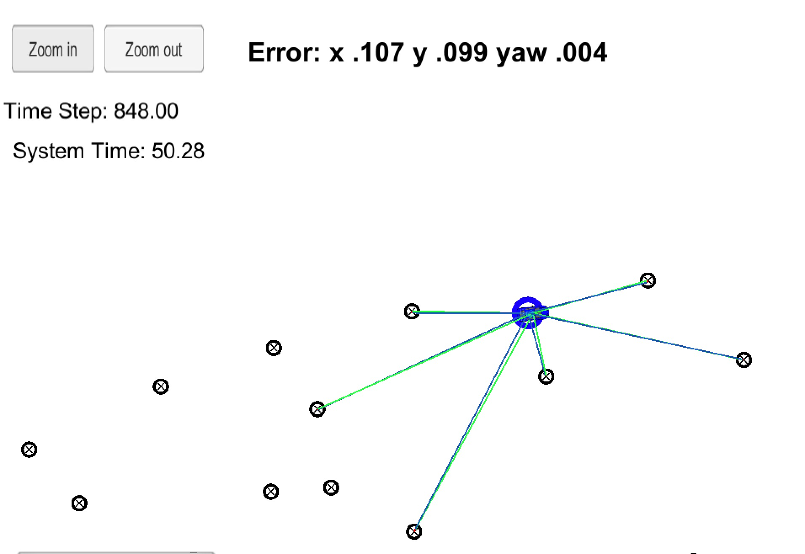

## Kidnapped Vehicle Project
---
Yangchun Luo<br>
Feb 21, 2018

This is the assignment for Udacity's Self-Driving Car Term 2 Project 3.

---
Your robot has been kidnapped and transported to a new location! Luckily it has a map of this location, a (noisy) GPS estimate of its initial location, and lots of (noisy) sensor and control data.

The goal of this project is to implement a 2 dimensional particle filter in C++. The particle filter will be given a map and some initial localization information (analogous to what a GPS would provide). At each time step the filter will also get observation and control data.

### To build

```bash
mkdir build
cd build
cmake ..
make
./particle_filter
```

### To run

Download the [Term 2 simulator suite](https://github.com/udacity/self-driving-car-sim/releases). Open it and choose the Kidnapped Vehicle project.

Other setup information can be found in the original [README](README-orig.md) file.

### Prediction Model Simplification

In the prediction model, ideally we should've used `std_a` and `std_yaw_rate`, similar to the UKF project. In this project, the prediction model is simplified to add individual Gaussian noise to the predicted values of each measurement: x position, y position, and heading.

### Performance result

After a full run, we achieved the following error rate:




